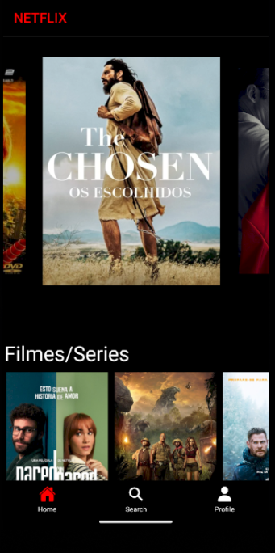

### NetflixApp

Este é um projeto desenvolvido por mim em uma aula no Senai em ADS, onde estavamos explorando o Flatlist no <b>Expo Go</b>. (De um jeito mais leigo o Flalist ajuda no carregamento da tela, assim não sobrecarregando com diversos conteúdos) 

### Instalação

Antes de tudo certifique de ter o Node 
    
    https://nodejs.org/en
Se não baixe e instale o NODE acima:
    
### 1. Clone o repositório:

    git clone https://github.com/Otavig/copyNetflixApp.git

### 2. Istale as dependências: 

    npm install -Nome da depêndencia-
Ou `RECOMENDO` apenas que digite `npm i` que automaticamente instala todas as dependências necessárias.

### 3. Iniciar o App:

    npx expo start
  
## Uso

- Iniciando o App você tera a opção de iniar por um `emulador` ou escaniando pelo `Qr code`

## Tecnologias Utilizadas
- **React Native**: Um framework JavaScript para construir aplicativos móveis multiplataforma nativos usando React.
- **React Navigation**: Biblioteca de roteamento e navegação para React Native, usada para navegar entre telas e gerenciar a pilha de navegação.
- **AsyncStorage**: API de armazenamento persistente assíncrono para React Native, usada para armazenar dados localmente no dispositivo do usuário.
- **@expo/vector-icons**: Pacote de ícones para React Native, usado para renderizar ícones vetoriais, como os ícones do Ionicons.
- **Dimensions**: API do React Native para obter dimensões da tela do dispositivo, usada aqui para calcular o número de colunas em uma lista de itens com base na largura da tela.
- **FlatList**: Componente do React Native para renderizar listas de dados, otimizado para melhor desempenho e renderização eficiente de grandes conjuntos de dados.
- **TouchableOpacity**: Componente do React Native usado para detectar toques em um elemento, fornecendo feedback visual ao usuário.
- **StyleSheet**: Módulo do React Native usado para criar estilos estilizados para componentes.
  
## Autor

Otávio Garcia dos Santos
